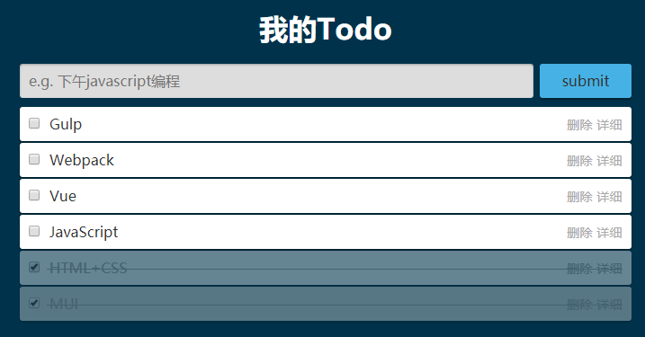
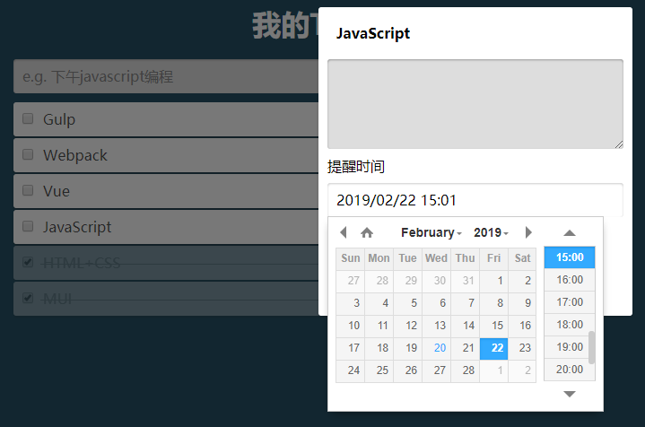

# JQuery-Todo

## 1. 项目描述

本项目为清单应用。主要包括添加待完成事件，可设置提醒，添加详细描述，对已完成事件进行删除。

本项目使用主要使用 jQuery 实现，通过 `Store.js` 实现对localStorage读取与存储，使用 `datetimepicker插件` 进行对日期的选择。通过自定义alert()，进行提示。

## 2. 如何运行

在浏览器中运行 `index.html`

## 3. 项目展示

